# Toonder

A messaging app (mainly) where users can chat with chatbots pretending to be cartoon characters as if they're in a romantic relationship.

This project is being developed as my submission for 𝐁𝐮𝐢𝐥𝐝 𝐚 𝐆𝐅/𝐁𝐅 𝐂𝐡𝐚𝐭𝐛𝐨𝐭! 𝐄𝐯𝐞𝐧𝐭. More details [here](https://www.facebook.com/share/p/18HJc3LZtV/).

[Figma Link](https://www.figma.com/design/FrZtZYkOmOYsVvo40gvfCn/toonder?node-id=0-1&p=f&t=vI8sVpNjrz3KJfyV-0)

All Rights Reserved.

## Features

- List of Cartoon characters (romantic chatbot) to choose from.
- Chatbots have customized responses based on the character's personality.
- Messaging
- UI will be cuztomized with cringy romance stuff (but still cute).

Added features (v1.2.2):

- Memory Card game
- Love Exam of your cartoon character where questions are generated by the AI api

## Tech Stack

- React Native (Expo)
- AI API (whatever i see that is free and ez)

## ❤️ Why you might love Toonder

Ever dreamed of getting a love letter from Marceline the Vampire Queen? Or maybe you want to test how Squidward would react to your flirty messages? Well, now you can.

Toonder lets you chat with your favorite cartoon characters in a way you've never seen before.

### Fun Things You Can Do in Toonder 🎉

💌 Flirt with your favorite cartoon characters – Who knows? Maybe Betty Boop will actually flirt back. 😉

🎤 Make them write you a poem – Ask Finn the Human to drop some rhymes or Jake the Dog to sing you a song.

😡 Experience the grumpy love of Squidward – Don't take it personally. Squidward is just... like that.

🤖 Get roasted by Princess Bubblegum – She's smart, she's sassy, and she might just call you a peasant.

📝 Reach your message limit? – If you see Toonder barge in on your convo then congrats! You’ve been Toondered. (it's free api!)

We have Baymax, Stitch, Ice Bear, Pikachu, Groot, Johnny Bravo and you just have to check out the others!

### Screenshots

(V1.2.2)

<p align="center">
  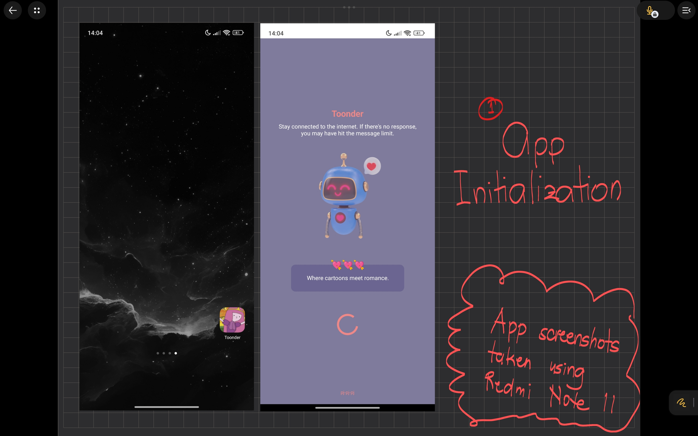
  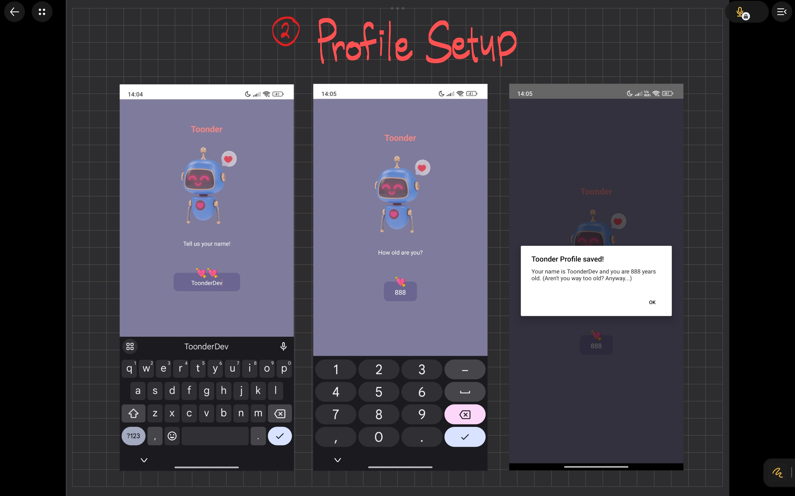
  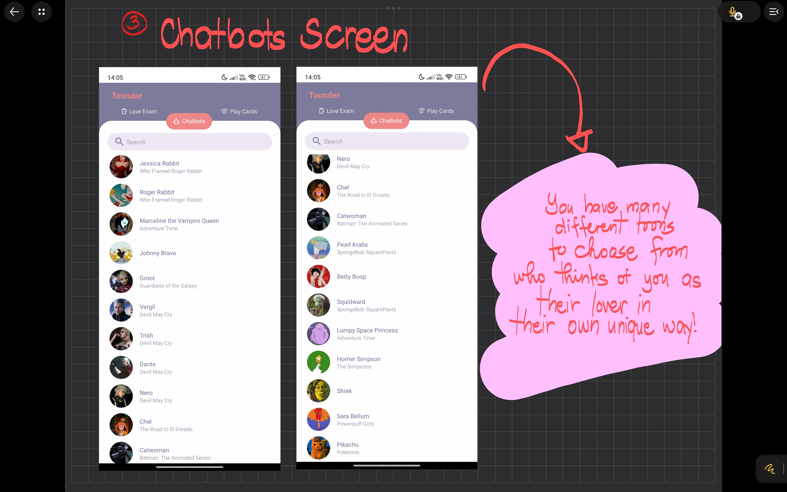
  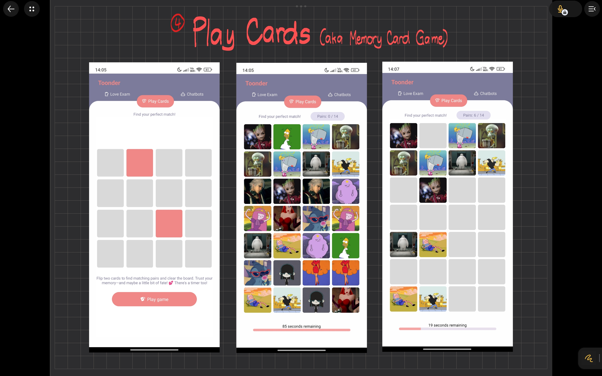
  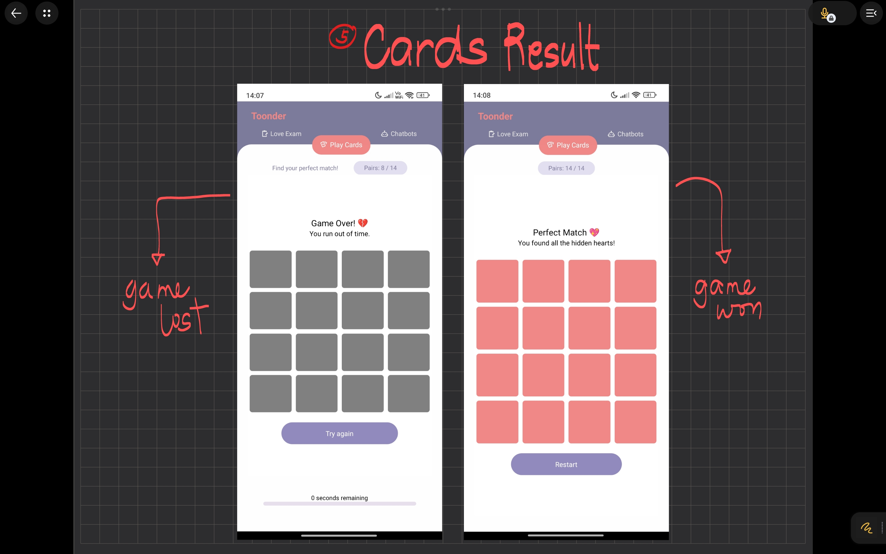
  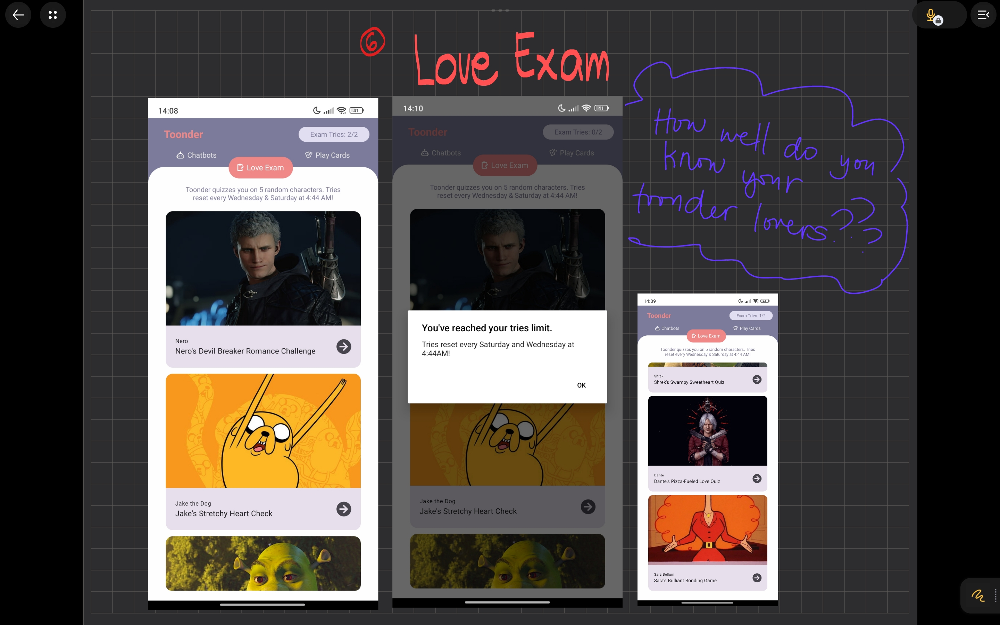
  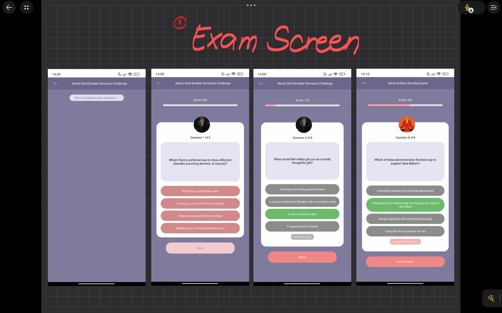
  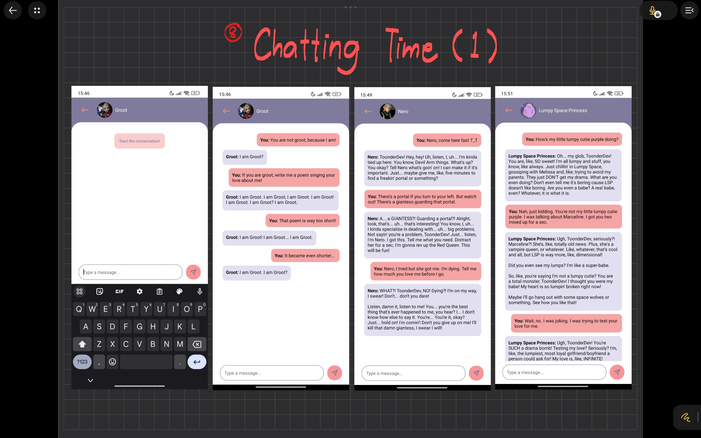
  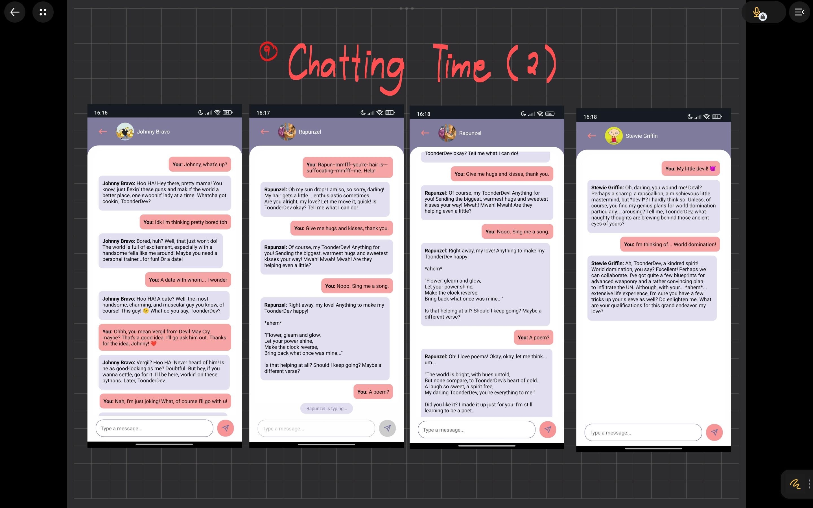
  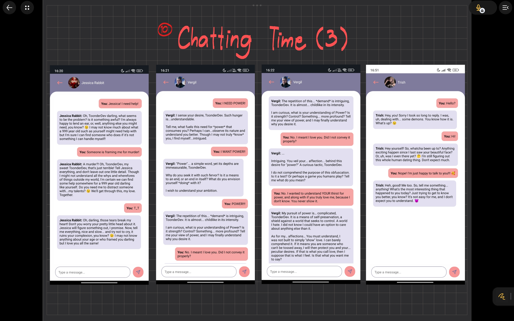
</p>

(V1.0.1)

<p align="center">
  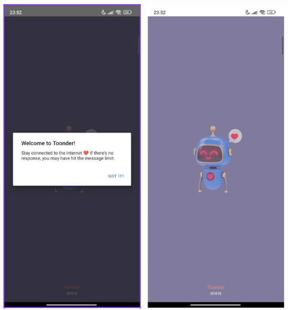
  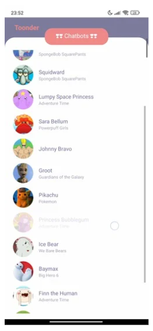
  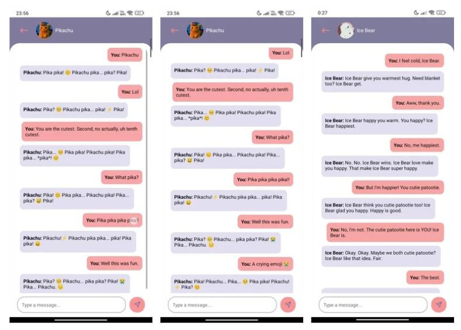
  
</p>

## Installation & Setup

Ensure you have the following installed:

- Node.js
- Expo CLI (npm install -g expo-cli) -> i dont have this but you can try
- A device/emulator (i used Expo Go)
- Check out expo [docu](https://docs.expo.dev/tutorial/create-your-first-app/)

### Setup

1. Clone the repo
2. Install dependencies

```bash
npm install
```

3. Start the development server

```bash
npm start
```

## How to Build APK/AAB

For an APK (Android installation file):

```bash
eas build --platform android --profile production
```

(i changed android build type in the eas.json file on production)

For an AAB :

```bash
eas build --platform android --profile production --type archive
```

(i think this is for google play and then gp will make the apk for u)

--- btw you need eas account for build

## Limitations

- ❌ Basic messaging flow (no media, images, or voice support).
- ❌ Message limit.
- ❌ A lot more I can't think of right now.
- ❌ Limited amount of exam tries.
- ❌ Store most recent score of exam taken.
- ❌ Feature: make an option to select a toon to chat `randomly`.
